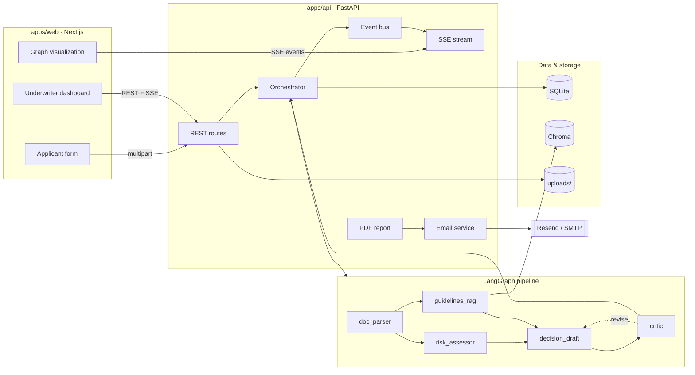

# UnderwriteAI

AI-powered health insurance underwriting for the Rwandan market. Multi-agent pipeline with human-in-the-loop review, explainable decisions, and built-in fairness guardrails.

## Architecture



## Quick start

```bash
# clone and set up env
cp .env.example .env
# fill in API keys

# backend
cd apps/api && uv sync && cd ../..

# frontend
cd apps/web && pnpm install && cd ../..

# seed data
make seed

# run both
make api  # terminal 1
make web  # terminal 2
```

## Development

```bash
make api      # start api server
make web      # start next.js dev server
make test     # run unit tests
make lint     # lint and type-check
make seed     # seed chroma + demo data
make smoke    # end-to-end smoke test
```

## Project structure

```
underwrite-ai/
├── apps/
│   ├── api/          # FastAPI + LangGraph backend
│   └── web/          # Next.js 14 frontend
├── docs/             # architecture docs, demo script
├── .github/workflows # CI
├── Makefile
└── docker-compose.yml
```

## Testing

Four test layers:

- **Unit** (`test_tools.py`) — deterministic tool functions (BMI, age band, risk scoring)
- **Routes** (`test_routes.py`) — API validation, serialization, status codes
- **RAG** (`test_rag.py`) — retrieval regression against expected rule matches
- **Graph** (`test_graph.py`) — golden-path tests per persona with recorded LLM fixtures
- **Smoke** (`smoke_test.py`) — full end-to-end with real LLMs (manual)

```bash
make test              # unit + route + rag tests
make smoke             # full e2e (requires API keys)
```

## License

MIT
