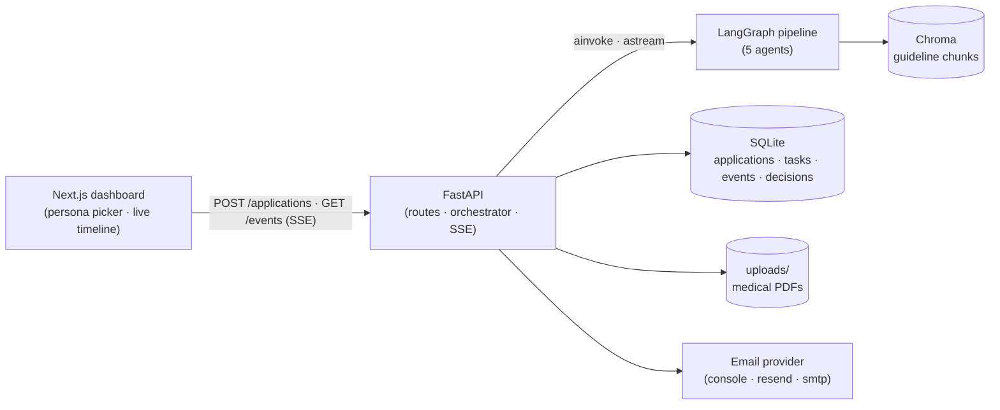
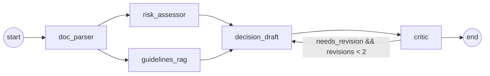

# UnderwriteAI

AI-assisted health insurance underwriting for the Rwandan market. A multi-agent
LangGraph pipeline parses medical PDFs, scores risk against an underwriting
manual, drafts a verdict with cited rules, and runs an adversarial fairness
critic — then hands off to a human underwriter who can approve, modify, or
re-evaluate before an email goes out.

This is an AI engineering bootcamp capstone. The goal is to demonstrate a
production-shaped agent system, not a deployed product.

## How it works



Inside the graph:



`doc_parser` and `guidelines_rag` run in parallel; the critic can ask for one
revision pass before the verdict is finalized. The Rwanda region adapter
provides a deterministic regex backstop that flags Ubudehe / CBHI / district
mentions as bias regardless of what the LLM critic concludes.

## Quick start

```bash
# 1. clone + env
git clone https://github.com/mcaleb808/underwrite-ai && cd underwrite-ai
cp apps/api/.env.example apps/api/.env  # fill OPENROUTER_API_KEY + OPENAI_API_KEY
cp apps/web/.env.example apps/web/.env.local

# 2. install
cd apps/api && uv sync && cd ../..
cd apps/web && pnpm install && cd ../..

# 3. seed Chroma with the underwriting manual
make seed

# 4. start both services
make api        # terminal 1 → http://localhost:8000
make web        # terminal 2 → http://localhost:3000
```

Open [http://localhost:3000](http://localhost:3000), pick a seed applicant, and
watch the pipeline run.

## Make targets

| Target       | Purpose                                                         |
|--------------|-----------------------------------------------------------------|
| `make api`   | run FastAPI with autoreload on port 8000                        |
| `make web`   | run Next.js dev server on port 3000                             |
| `make test`  | run the CI-safe test suite (no LLM calls)                       |
| `make lint`  | ruff + ruff-format + ESLint                                     |
| `make format`| ruff --fix + ruff format                                        |
| `make seed`  | ingest the underwriting manual into Chroma                      |
| `make smoke` | run the stub-graph smoke test                                   |
| `make demo`  | run the full graph against all five seed personas (real LLM)    |

## Project layout

```
underwrite-ai/
├── apps/
│   ├── api/                     # FastAPI + LangGraph backend (Python 3.12, uv)
│   │   └── src/
│   │       ├── adapters/        # region adapter Protocol (RW today)
│   │       ├── data/            # underwriting manual · seed personas · districts
│   │       ├── db/              # SQLAlchemy models + async session
│   │       ├── graph/           # state · builder · routing · 5 nodes
│   │       ├── rag/             # chunker · ingest · retriever
│   │       ├── routes/          # applications · personas
│   │       ├── schemas/         # pydantic models (applicant · medical · decision · api)
│   │       ├── scripts/         # seed_chroma · run_persona · run_all_personas · smoke_test
│   │       ├── services/        # orchestrator · event_bus · email · reference
│   │       └── tools/           # bmi · age_band · district_prevalence · risk_scoring · pdf_extract
│   └── web/                     # Next.js 16 dashboard (App Router · React 19 · Tailwind 4)
│       └── src/
│           ├── app/             # / · /applications/[taskId]
│           ├── components/      # Live · Timeline · DecisionCard · ReviewActions · ...
│           └── lib/             # api client · types
├── docs/
│   └── architecture.md          # design + tradeoffs
├── .github/workflows/ci.yml     # api lint+test · web lint+typecheck
├── CLAUDE.md
├── Makefile
└── README.md
```

## Testing

CI runs lint + the fast suite on every PR. Anything that needs a real LLM is
marked `pytest.mark.slow` and skipped in CI.

| Layer       | Where                                       | What it catches                                |
|-------------|---------------------------------------------|------------------------------------------------|
| Tools       | `tests/test_tools.py`                       | BMI, age band, district lookup, scoring math   |
| Routes      | `tests/test_*_route*.py`                    | validation, serialization, status codes        |
| RAG units   | `tests/test_chunks.py`                      | markdown chunker output                        |
| RAG e2e     | `tests/test_rag.py` *(slow)*                | retrieval drift on 12 known queries            |
| Event bus   | `tests/test_events_sse.py`                  | pub/sub + SSE history replay                   |
| Smoke       | `apps/api/src/scripts/smoke_test.py`        | full graph end-to-end (manual)                 |

```bash
make test                                    # CI-safe suite
cd apps/api && uv run pytest -m slow         # slow suite (needs OPENAI_API_KEY)
```

## Documentation

- [`docs/architecture.md`](docs/architecture.md) — state contract, agent
  responsibilities, RAG strategy, persistence model, decision lifecycle,
  fairness backstop, and the key tradeoffs.
- [`CLAUDE.md`](CLAUDE.md) — quick orientation for AI coding tools.

## License

MIT
