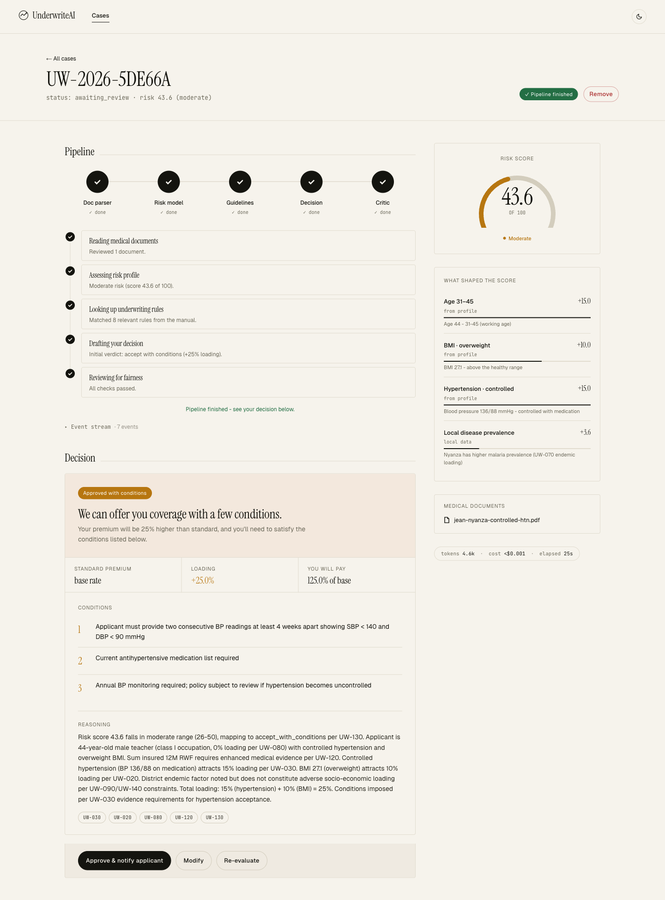
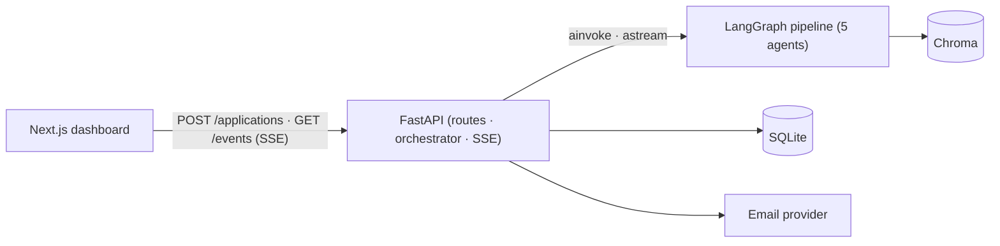
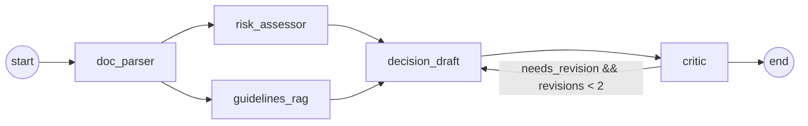

# UnderwriteAI

AI-assisted health insurance underwriting for the Rwandan market. A multi-agent
LangGraph pipeline parses medical PDFs, scores risk against an underwriting
manual, drafts a verdict with cited rules, and runs an adversarial fairness
critic — then hands off to a human underwriter who can approve, modify, or
re-evaluate before an email goes out.



## The problem

Underwriting health insurance for a typical Rwandan applicant is a
document-heavy, judgment-heavy job: read the medical PDFs, weigh comorbidities
against age and BMI, look up the right rules in a binder of underwriting
guidelines, decide what to load on the premium, and draft a customer email
that's empathetic without leaking internal rule IDs. UnderwriteAI does the
mechanical 80% — parsing, scoring, rule retrieval, draft + critic, customer
email — and surfaces every step to a senior underwriter for the final call.

## Quick start

```bash
# 1. clone + env
git clone https://github.com/mcaleb808/underwrite-ai && cd underwrite-ai
cp apps/api/.env.example apps/api/.env  # fill OPENROUTER_API_KEY + OPENAI_API_KEY
cp apps/web/.env.example apps/web/.env.local

# 2. install
cd apps/api && uv sync && cd ../..
cd apps/web && pnpm install && cd ../..

# 3. seed Chroma with the underwriting manual
make seed

# 4. start both services
make api        # terminal 1 → http://localhost:8000
make web        # terminal 2 → http://localhost:3000
```

Open [http://localhost:3000](http://localhost:3000), pick a seed applicant, and
watch the pipeline run.

## How it works



Inside the graph:



Five nodes: `doc_parser` and `guidelines_rag` run in parallel; `risk_assessor`
is deterministic Python; the critic can request one revision pass before the
verdict is finalized. Per-node prompts, models, and structured-output schemas
are documented in [`docs/agents.md`](docs/agents.md).

## Documentation

| Topic | Read |
|---|---|
| Architecture, design patterns, and tradeoffs | [`docs/architecture.md`](docs/architecture.md) |
| Agents, prompts, and resilience | [`docs/agents.md`](docs/agents.md) |
| Observability — logs, traces, /health, /metrics | [`docs/observability.md`](docs/observability.md) |
| Evaluation — golden cases and what they assert | [`docs/evaluation.md`](docs/evaluation.md) |
| Deployment — Cloud Run, Vercel, Terraform | [`docs/deployment.md`](docs/deployment.md) |
| Test strategy | [`docs/testing.md`](docs/testing.md) |
| Latest eval results | [`docs/eval-report.md`](docs/eval-report.md) |

## Project layout

```text
underwrite-ai/
├── apps/
│   ├── api/              # FastAPI + LangGraph backend (Python 3.12, uv)
│   │   └── src/
│   │       ├── adapters/   # region adapter Protocol (RW today)
│   │       ├── data/       # underwriting manual · seed personas · districts
│   │       ├── db/         # SQLAlchemy models + async session
│   │       ├── graph/      # state · builder · routing · 5 nodes
│   │       ├── middleware/ # request-id propagation
│   │       ├── rag/        # chunker · ingest · retriever
│   │       ├── routes/     # applications · personas · health
│   │       ├── schemas/    # pydantic models
│   │       ├── scripts/    # seed_chroma · run_eval · smoke_test
│   │       ├── services/   # orchestrator · event_bus · email · log · tracing
│   │       └── tools/      # bmi · age_band · risk_scoring · pdf_extract
│   └── web/              # Next.js 16 dashboard (App Router · React 19 · Tailwind 4)
├── docs/                 # architecture, agents, observability, evaluation, deployment, testing
├── infra/                # Terraform: artifact_registry, cloud_run, secrets, service_account, wif
├── .github/workflows/    # ci · deploy · deploy-web · eval
├── Makefile
└── README.md
```

## Make targets

| Target       | Purpose                                                         |
|--------------|-----------------------------------------------------------------|
| `make api`   | run FastAPI with autoreload on port 8000                        |
| `make web`   | run Next.js dev server on port 3000                             |
| `make seed`  | ingest the underwriting manual into Chroma                      |
| `make test`  | run the CI-safe test suite (no LLM calls)                       |
| `make lint`  | ruff + ruff-format + ESLint                                     |
| `make eval`  | run the golden-case suite and rewrite `docs/eval-report.md`     |
| `make smoke` | run the stub-graph smoke test                                   |
| `make demo`  | run the full graph against all five seed personas (real LLM)    |

## License

MIT
