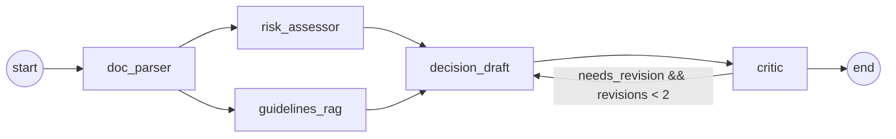
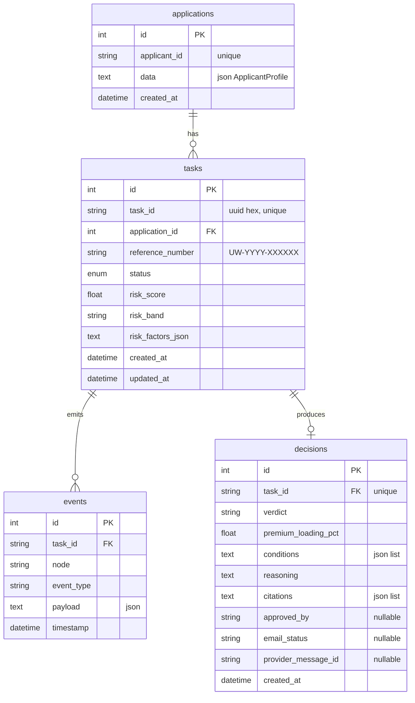
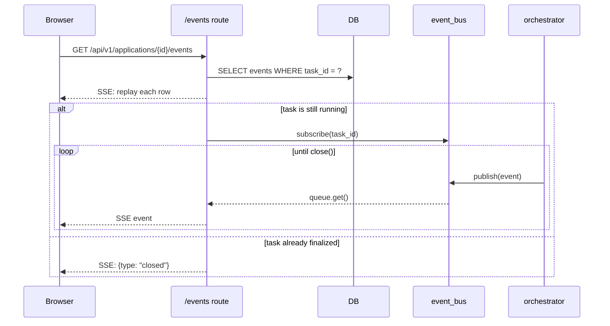

# Architecture

This document covers the design decisions behind UnderwriteAI: how the agent
pipeline is wired, how state flows through it, where the deterministic guard
rails sit, and the tradeoffs taken along the way.

For a runnable overview, see the root [`README.md`](../README.md).

## Scope

In scope:

- Multi-agent underwriting pipeline (LangGraph) with parallel branches and a
  bounded revision loop.
- Markdown-aware RAG over a synthetic Rwandan underwriting manual.
- Deterministic risk scoring and a deterministic regex bias backstop.
- Live event streaming from the orchestrator to the browser via SSE.
- Human-in-the-loop modify / approve / re-evaluate workflow with email
  delivery via a swappable provider.

Out of scope (for the capstone):

- Production deployment, multi-tenant auth, billing, real PHI handling.
- Database migrations (we use `Base.metadata.create_all` on startup; an
  Alembic baseline is the natural follow-up).
- A custom application form (the dashboard runs five seed personas today).

## System view

```mermaid
flowchart TB
  subgraph web["apps/web - Next.js 16"]
    Home["/ persona picker + recent runs"]
    Detail["/applications/[taskId] live timeline + review"]
  end

  subgraph api["apps/api - FastAPI"]
    Apps[applications router]
    Pers[personas router]
    Orch[orchestrator]
    Bus[in-process event_bus]
  end

  subgraph graph["LangGraph pipeline"]
    DP[doc_parser]
    RA[risk_assessor]
    RAG[guidelines_rag]
    DD[decision_draft]
    CR[critic]
  end

  subgraph storage["Storage"]
    SQLite[(SQLite)]
    Chroma[(Chroma)]
    FS[("uploads/<br/>medical PDFs")]
  end

  Home -- "POST /applications" --> Apps
  Detail -- "GET /events (SSE)" --> Apps
  Detail -- "PATCH /decision · POST /approve · /reeval" --> Apps
  Apps -- BackgroundTask --> Orch
  Orch -- astream(updates) --> graph
  RAG --> Chroma
  Orch --> Bus
  Bus -- per-task queue --> Apps
  Orch --> SQLite
  Apps --> SQLite
  Apps --> FS
```

The orchestrator runs the graph asynchronously inside FastAPI's BackgroundTasks
and persists each event the moment it arrives. The SSE endpoint replays history
from SQLite first, then attaches to the in-process event_bus for live updates.

## The state contract

The graph is a `TypedDict` with `total=False` so each node only updates the
fields it owns:

```python
class UnderwritingState(TypedDict, total=False):
    # inputs
    task_id: str
    applicant: ApplicantProfile
    medical_doc_paths: list[str]

    # doc_parser
    parsed_medical: Annotated[list[ParsedMedicalRecord], add]

    # risk_assessor
    risk_score: float
    risk_band: Literal["low", "moderate", "high", "very_high"]
    risk_factors: list[RiskFactor]

    # guidelines_rag
    retrieved_guidelines: list[GuidelineChunk]

    # decision_draft + critic
    decision: DecisionDraft | None
    critique: Critique | None
    needs_revision: bool
    revision_count: int

    # streaming / observability
    messages: Annotated[list[AnyMessage], add_messages]
    events: Annotated[list[dict], add]
    errors: Annotated[list[str], add]
```

Three append-only fields (`parsed_medical`, `events`, `errors`) use the `add`
reducer so parallel branches can safely contribute. Everything else gets
overwritten on each node return - the simpler default that matches how those
fields are used.

## Agents



| Node              | Type           | Inputs                                  | Outputs                                              |
|-------------------|----------------|------------------------------------------|------------------------------------------------------|
| `doc_parser`      | LLM (fast)     | `medical_doc_paths` or seed PDFs         | `parsed_medical` + `events.parsed`                   |
| `risk_assessor`   | deterministic  | `applicant`, `parsed_medical`            | `risk_score`, `risk_band`, `risk_factors` + event    |
| `guidelines_rag`  | RAG retrieval  | `applicant`, `risk_factors`              | `retrieved_guidelines` + event                       |
| `decision_draft`  | LLM (strong)   | risk fields + retrieved chunks (+critique on revision) | `decision` (DecisionDraft) + event |
| `critic`          | LLM + regex    | `decision`, `risk_factors`, `retrieved_guidelines`, `applicant` | `critique`, `needs_revision`, `revision_count++` + event |

`doc_parser` and `guidelines_rag` are independent and run in parallel after
input. The critic loop is hard-capped at `MAX_REVISIONS = 2` in
`graph/routing.py` - beyond that the latest draft becomes the final verdict
even if the critic still has issues. This keeps the demo bounded while
preserving the audit trail in the timeline.

### Why the critic is allowed to disagree forever

A real underwriting reviewer needs the LLM critic's opinion as a *signal*, not
a veto. We surface "issues remaining" in the dashboard so a human can see
exactly what the critic flagged before approving - that's the human-in-the-loop
contract.

## RAG over the underwriting manual

The manual is a single markdown file with one H2 section per rule
(`UW-001`–`UW-140`). The chunker (`src/rag/chunks.py`) splits on each H2 heading, parses
the rule id from the heading, and uses the entire section as one chunk. There
are only 15 rules, so chunk-splitting strategies (semantic, recursive, sliding
window) would be overkill - chunk-by-section maps 1:1 to the underwriter's
mental model and keeps citations clean.

Embeddings are OpenAI `text-embedding-3-small` written through Chroma's
`PersistentClient` at `./chroma_data`. Retrieval is Chroma's default cosine
similarity.

`guidelines_rag` builds a query from the applicant's declared history,
occupation, sum insured, and computed risk-factor names - then issues a
top-6 semantic search **plus** an explicit fetch of four pinned foundational
rules (`UW-070` district endemic, `UW-090` Ubudehe equity, `UW-130`
score-to-verdict, `UW-140` critic checks). Pinning came out of an early failure
mode where the drafter cited `UW-090` to refuse a district loading even though
that rule wasn't in the retrieved set - the critic correctly caught it, but
the cleaner fix is to make sure the universally-applicable rules are always in
scope.

## Region adapter pattern

`src/adapters/__init__.py` defines a `RegionAdapter` Protocol; `rw.py`
implements it. The adapter contributes:

- `extra_risk_factors(applicant)` - context-only factors with `contribution=0`
  (Ubudehe category, CBHI status) so they appear in the audit trail but never
  shift the score.
- `fairness_checks(draft, applicant)` - a deterministic regex scan for
  protected terms (`ubudehe`, `mutuelle`, `cbhi`, `district`-without-endemic)
  in the reasoning of any adverse verdict. The critic merges this with its
  LLM-derived issues; the regex result is the floor - even if the LLM thinks
  everything's fine, the regex match still flips `needs_revision = True`.
- `evidence_threshold_tier(sum_insured)` - maps RWF amounts to UW-120 tiers.

Adding a second region is a matter of writing another implementor and routing
to it; nothing in the graph is country-specific.

## Persistence model



`Application` is per-applicant; `Task` is per-run (re-evaluation creates a new
graph run on the same Application). `Event` is the system of record for what
each node did - both for the SSE history replay and for post-hoc auditing.
`DecisionRecord` is per-task and gets overwritten on `reeval` (the row is
deleted before the new graph run starts).

Schema is created by `Base.metadata.create_all` in the FastAPI lifespan hook.
For real deployment this should be replaced by an Alembic baseline migration.

## Live event streaming



The event bus (`services/event_bus.py`) is intentionally a tiny in-process
`dict[task_id, set[asyncio.Queue]]`. Slow consumers are dropped (per-queue
`maxsize=256`) rather than blocking the producer. For multi-worker deployment
this swaps cleanly for Redis pub/sub - the publish/subscribe surface stays
identical.

## Decision lifecycle

```mermaid
stateDiagram-v2
  [*] --> queued: POST /applications
  queued --> running: orchestrator picks up
  running --> awaiting_review: graph finalized with decision
  running --> failed: graph errored
  awaiting_review --> modified: PATCH /decision
  modified --> sent: POST /approve (email ok)
  modified --> approved: POST /approve (email failed)
  awaiting_review --> sent: POST /approve (email ok)
  awaiting_review --> approved: POST /approve (email failed)
  awaiting_review --> reeval: POST /reeval
  modified --> reeval: POST /reeval
  reeval --> running: orchestrator re-runs graph
  sent --> [*]
  approved --> [*]
  failed --> [*]
```



`reeval` deletes the existing `DecisionRecord` so the new run starts clean.
`approve` and `modify` are blocked while the task is `queued` or `running`.

## Email providers

`services/email/providers.py` defines an `EmailProvider` Protocol and two
implementations: `console` (logs to stdout - the dev default) and `resend`
(via the Resend API). The factory `get_email_provider()` picks one based on
`settings.EMAIL_PROVIDER` and is injected into the approve route via `Depends`.
Tests swap in a `FakeEmailProvider` that captures sent messages without
touching the network.

When `EMAIL_OVERRIDE_TO` is set, a `_resolve_recipient()` helper reroutes
every outbound message to that address and emits an `email_override`
structlog event for auditability. Production leaves it empty.

`services/email/composer.py` generates the customer-facing subject and body
via a single `FAST_MODEL` call, with a tight system prompt that forbids
internal rule IDs, risk scores, the raw verdict enum, and numeric premium
percentages. A deterministic template fallback fires if the LLM call
exhausts retries so a failed approve never ships an empty email.
`services/email/render.py` wraps the composed body in minimal HTML.

## Tradeoffs

| Choice                                         | Why                                                                                                      |
|------------------------------------------------|----------------------------------------------------------------------------------------------------------|
| OpenRouter as the single LLM gateway           | One API key, many models, easy provider swap; doesn't hide token usage or break LangChain interop.       |
| Claude Sonnet 4.5 for strong / GPT-4o-mini fast | Strong needs structured output + careful reasoning (decision, critic). Fast is fine for PDF extraction.  |
| Chroma over pgvector                            | One-line setup; persistent client is enough for 15 chunks; swap when scale demands it.                   |
| SQLite + aiosqlite                              | Single file, no infra. The whole DB is a few MB even with months of demo runs.                           |
| `Base.metadata.create_all` instead of Alembic   | One PR's worth of setup; revisit when schema changes need staged rollout.                                |
| In-process event_bus                            | Demo runs in one process; swap to Redis pub/sub if we ever scale horizontally.                           |
| Pinned foundational rules in RAG                | Eliminates "drafter cited rule X but it wasn't retrieved" failures with no impact on retrieval quality.  |
| Hard-cap revisions at 2                         | Bounded latency for the demo; the critic's findings are still surfaced to the human reviewer.            |
| Region-specific logic behind a Protocol         | Lets the graph stay country-agnostic; adding a second region is one new implementor, not a fork.         |
| Hand-mirrored TS types                          | A 50-line `types.ts` is easier to read and review than generated output, and there's only one boundary.  |

## What I'd build next

1. **Alembic baseline** - make the schema upgradable.
2. **Custom application form** - let users post their own `ApplicantProfile` and PDFs from the dashboard, not just seed personas.
3. **PDF report generation** - attach a one-page decision summary to the approval email.
4. **Replay-mode LLM fixtures** - record once, run free in CI; would unlock golden-path graph tests.
5. **Redis pub/sub adapter** behind the same `event_bus` interface for multi-worker deployment.
