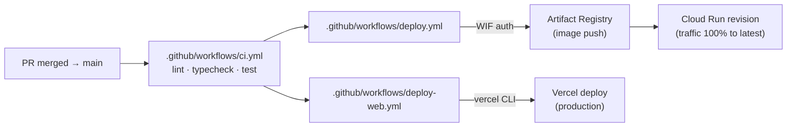

# Deployment

The system runs in two places: the AI backend on **GCP Cloud Run**, the dashboard on **Vercel**. Everything Google-side is described in Terraform, scales to zero when nobody's using it, and can be torn down cleanly with one command. The story is meant to be reproducible end-to-end from a fresh GCP project.

This page is a quick tour of what runs where, how the deploy pipeline works, and what each Terraform module does.



---

## Backend — Cloud Run

The API is packaged as a Docker image. The build is multi-stage: one stage installs Python dependencies with `uv`, the next stage copies just what's needed into a slim runtime image. The seed medical PDFs are baked into the image at build time so the container is self-contained on boot. Runtime: `tini` as PID 1, a non-root user, listening on `PORT=8080`.

📁 [`apps/api/Dockerfile`](../apps/api/Dockerfile)

The deploy workflow ([`deploy.yml`](../.github/workflows/deploy.yml)) does three things on every push to `main`:

1. authenticates to GCP using **Workload Identity Federation** — no long-lived service-account keys ever leave GitHub;
2. builds the image and pushes it to Artifact Registry;
3. rolls a new Cloud Run revision and shifts 100% of traffic to it.

Secrets (LLM keys, Langfuse keys, etc.) are pulled from **GCP Secret Manager** at container start. They're never committed to the repo, never pasted into CI variables, and never written to the Terraform state file in plaintext (the runtime SA gets accessor IAM, not the secret values).

### Cost posture: zero when idle

The Cloud Run service is configured with `min_instances=0` and `cpu_idle=true`. Translation: when nobody's using it, no instances are running and you pay nothing. The first request after an idle period does pay a cold-start tax of ~3-6 seconds while a fresh instance boots. For a system intended for occasional, deliberate review sessions, that's the right tradeoff — pay for compute when underwriters are working, not at 3 a.m.

---

## Frontend — Vercel

The Next.js dashboard deploys via [`deploy-web.yml`](../.github/workflows/deploy-web.yml). It uses a project-scoped Vercel token, runs `vercel deploy --prod`, and that's the whole story. The browser knows where to hit the API because `NEXT_PUBLIC_API_URL` is set in Vercel's project settings and baked into the build.

---

## Infra-as-code

All GCP resources are declared in Terraform. The root config is [`infra/main.tf`](../infra/main.tf); the modules are under [`infra/modules/`](../infra/modules/):

| Module | Purpose | What it owns |
|---|---|---|
| `artifact_registry` | the Docker repo | one private repository for the API image |
| `service_account` | the Cloud Run runtime identity | a dedicated SA + IAM for Secret Manager and Cloud Trace |
| `wif` | GitHub Actions ↔ GCP trust | a Workload Identity Federation pool + provider, scoped to this one repo |
| `secrets` | application secrets | LLM keys, Langfuse keys; values supplied locally, never committed |
| `cloud_run` | the API service itself | the Cloud Run service, env vars, secret bindings, public IAM |

State lives in a versioned GCS bucket, configured via `infra/.backend-config`. Standard loop:

```bash
cd infra
terraform init
terraform plan
terraform apply
```

For tear-down, `terraform destroy` removes everything Terraform created — the Cloud Run service, the secrets, the IAM bindings, the SA, the WIF pool, the Artifact Registry repository, even the GCP API enablements that were toggled on by this stack. There are no manual steps in either direction.

---

## Eval pipeline

[`eval.yml`](../.github/workflows/eval.yml) is a manual-dispatch workflow that runs the golden-case suite against the deployed configuration and uploads `docs/eval-report.md` as a build artifact. See [`docs/evaluation.md`](evaluation.md) for what each case asserts.

---

## Observability in production

When the API boots on Cloud Run (detected via the `K_SERVICE` env var), tracing wires itself up automatically — OpenTelemetry exports HTTP spans to GCP Cloud Trace, and Langfuse callbacks (if keys are present) ship LLM traces to Langfuse Cloud. Locally, you don't need GCP configured at all; the tracing setup is gated on the env var, so local dev only ships traces if you've explicitly opted in. See [`docs/observability.md`](observability.md) for the full story.
