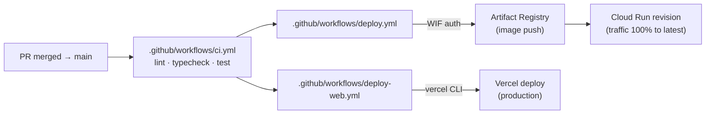

# Deployment

The system runs on two managed platforms: the FastAPI backend on **GCP Cloud Run**, the Next.js frontend on **Vercel**. All GCP infrastructure is Terraform-managed, scale-to-zero by default, and `terraform destroy` is a clean path. The deploy story is reproducible end-to-end from a fresh GCP project.



## Backend — Cloud Run

[`apps/api/Dockerfile`](../apps/api/Dockerfile) is a multi-stage build with `uv` for dependency resolution and the seed medical PDFs baked into the image so the container is self-contained at boot. Runtime: slim Python image, `tini` as PID 1, non-root app user, `PORT=8080`.

The deploy workflow [`.github/workflows/deploy.yml`](../.github/workflows/deploy.yml) authenticates to GCP via **Workload Identity Federation** (no long-lived service-account keys), builds and pushes the image to Artifact Registry, and rolls a new Cloud Run revision. Secrets are read from GCP Secret Manager at container start — never committed, never pasted into CI variables.

**Cost posture.** `min_instances=0` and `cpu_idle=true` mean the service scales to zero between runs. Cold start adds ~3-6 s on the first request after idle; the tradeoff is zero idle cost. For demo purposes that's the right shape.

## Frontend — Vercel

The Next.js 16 app deploys via [`.github/workflows/deploy-web.yml`](../.github/workflows/deploy-web.yml) using the Vercel CLI and a project-scoped token. `NEXT_PUBLIC_API_URL` is configured in Vercel and baked into the build, so the browser knows where to hit the API.

## Infra-as-code

Terraform sources are in [`infra/`](../infra/). Five composable modules:

| Module | Purpose |
|---|---|
| [`modules/artifact_registry`](../infra/modules/artifact_registry/) | Docker repository for the API image |
| [`modules/service_account`](../infra/modules/service_account/) | Cloud Run runtime SA + IAM (Secret Manager accessor, Cloud Trace agent) |
| [`modules/wif`](../infra/modules/wif/) | Workload Identity Federation pool + provider for GitHub Actions |
| [`modules/secrets`](../infra/modules/secrets/) | Secret Manager entries (LLM keys, Langfuse keys, etc.) |
| [`modules/cloud_run`](../infra/modules/cloud_run/) | The Cloud Run service, env, secrets binding, and IAM |

Root module [`infra/main.tf`](../infra/main.tf) enables the GCP APIs (`run.googleapis.com`, `secretmanager.googleapis.com`, `cloudtrace.googleapis.com`, …), instantiates the modules in dependency order, and emits the GitHub Actions secrets needed by the deploy workflows. State lives in a versioned GCS bucket configured via `infra/.backend-config`.

Standard loop:

```bash
cd infra
terraform init
terraform plan
terraform apply
```

For tear-down, `terraform destroy` removes everything Terraform created — Cloud Run service, secrets, IAM bindings, the SA, the WIF pool, the Artifact Registry repository, and the API enablements that were toggled on by this stack.

## Secrets

All sensitive config is read from `apps/api/.env` locally (gitignored) and from GCP Secret Manager in production. The Cloud Run module wires the relevant secrets into the runtime environment by reference (`secret_key_ref`), not by value, so they never appear in Terraform state plaintext.

## Eval pipeline

[`.github/workflows/eval.yml`](../.github/workflows/eval.yml) is a manual-dispatch workflow that runs the golden-case suite against the deployed configuration and uploads `docs/eval-report.md` as a build artifact. See [`docs/evaluation.md`](evaluation.md) for what each case asserts.

## Observability in deploy

Tracing wires up automatically when `K_SERVICE` is set (Cloud Run) and the relevant Langfuse env vars are present — see [`docs/observability.md`](observability.md). The Cloud Trace exporter is gated on the `K_SERVICE` env var so local dev doesn't try to ship spans to GCP.
