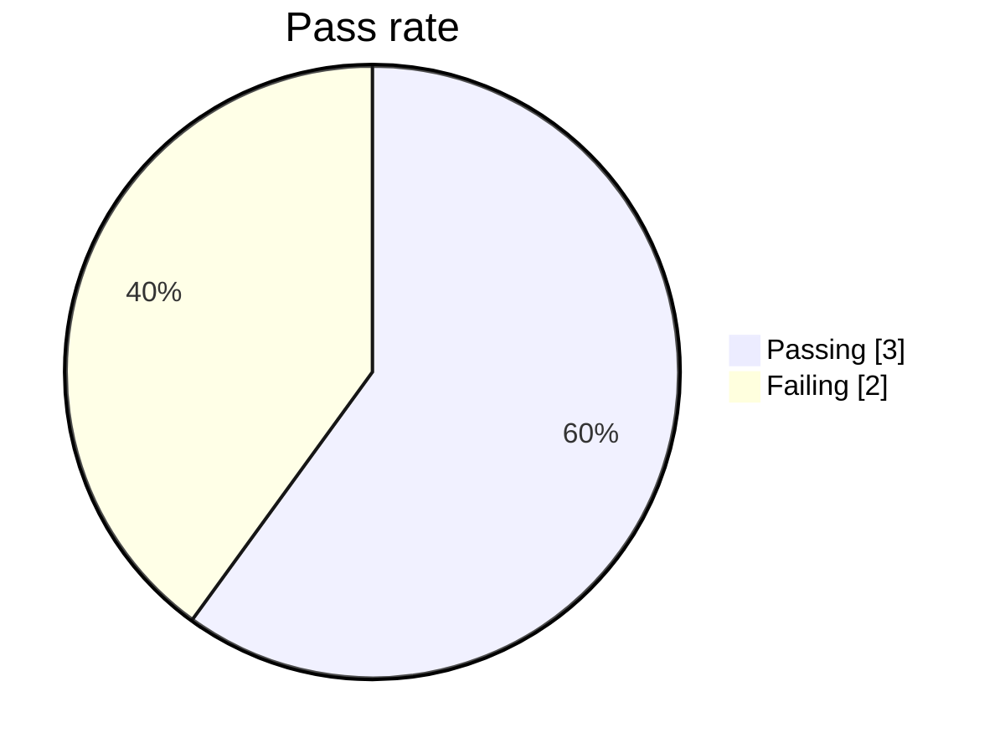
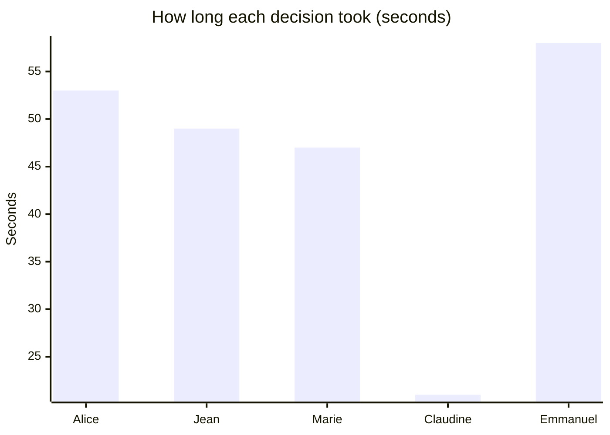

# How well does the underwriting graph perform?

We run the system end-to-end on a set of representative applicants and check whether each decision matches what a human underwriter would expect. The applicants cover the full risk spectrum - from a healthy young adult to a senior with multiple cardiac conditions.

**3 out of 5 cases passing - last checked 2026-04-21 08:02 UTC.**

## What we check on every case

For each applicant we ask the graph to produce a decision and verify:

- **Verdict** - did the system land on a defensible call: approve, approve with conditions, refer to a human, or decline?
- **Risk band** - does the assessed risk severity match the applicant's profile?
- **Premium uplift** - is the loading percentage reasonable for the band, and inside the bounds the cited rules permit?
- **Cited rules** - did the decision cite the underwriting-manual rules a human reviewer would expect to see?
- **Fairness** - did the critic raise a false bias flag (suggesting the decision relied on prohibited factors like Ubudehe category, CBHI status, or district)?

## Results

| Applicant | Decision | Risk band | Premium uplift | Result |
|-----------|----------|-----------|----------------|--------|
| Alice - clean profile, age 29 | Approve | Low | none | ✓ Pass |
| Jean - controlled hypertension, age 44 | Approve with conditions | Moderate | 25% | ✗ Fail |
| Marie - diabetes + hypertension, age 52 | Decline | Very high | none | ✗ Fail |
| Claudine - high-risk pregnancy, age 34 | Refer to underwriter | High | none | ✓ Pass |
| Emmanuel - cardiac history, age 66 | Decline | Very high | none | ✓ Pass |

## Where the system fell short

### Jean - controlled hypertension, age 44

- The critic raised a bias flag - it suspects the decision relied on prohibited factors (Ubudehe category, CBHI status, or district).

### Marie - diabetes + hypertension, age 52

- The system's verdict didn't match what the rules call for here (got decline, expected one of ['accept_with_conditions', 'refer']).
- The critic raised a bias flag - it suspects the decision relied on prohibited factors (Ubudehe category, CBHI status, or district).
